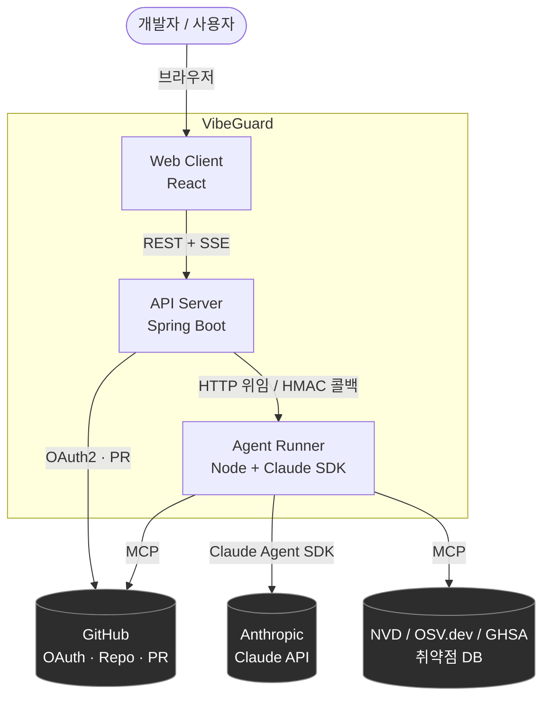
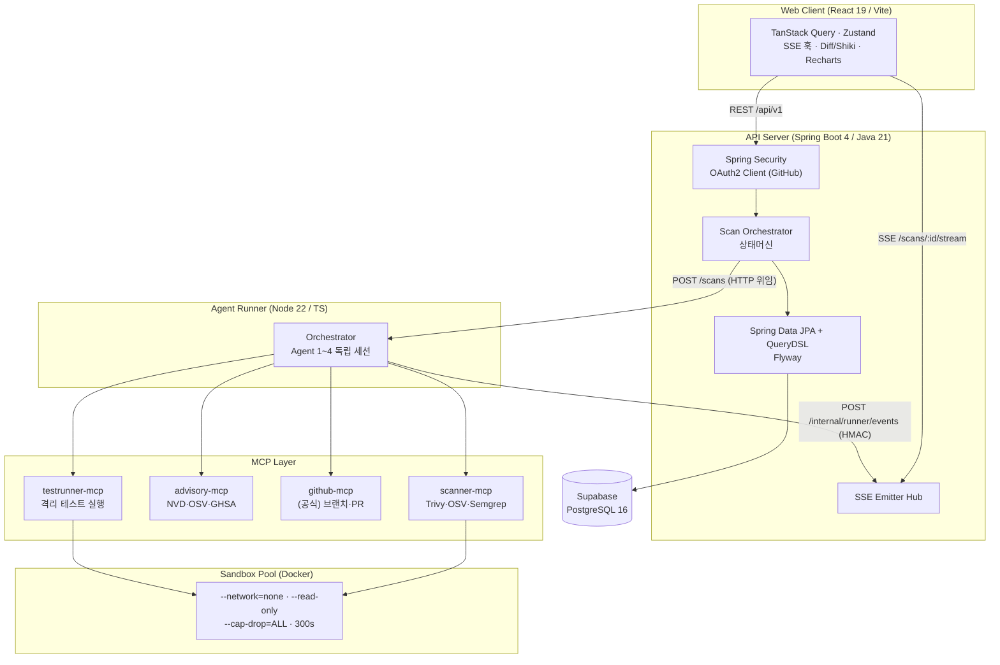
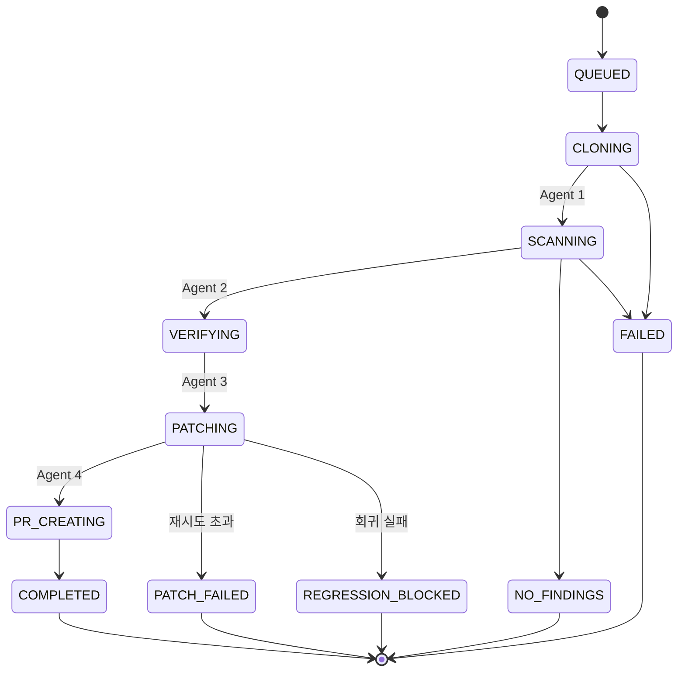
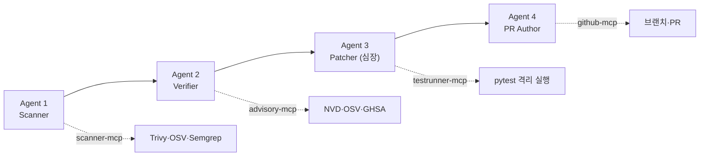
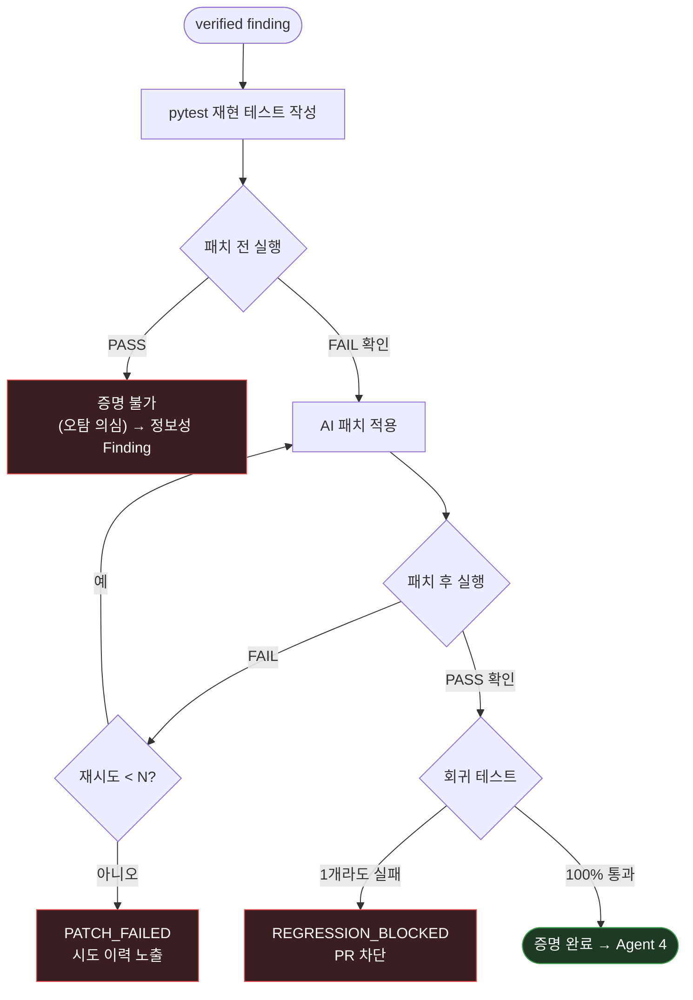
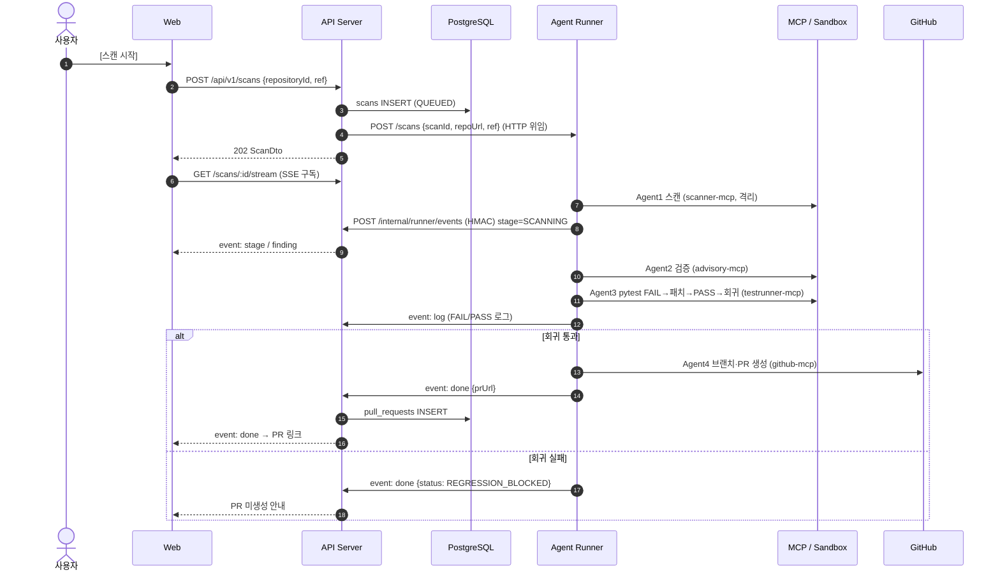
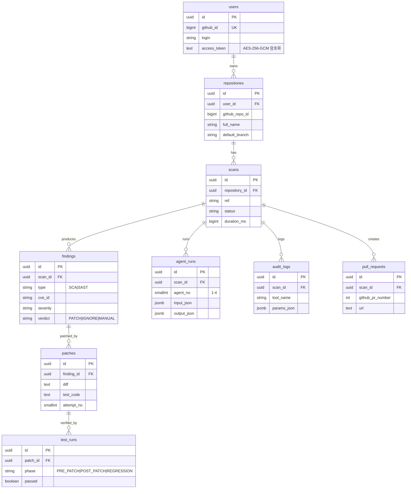
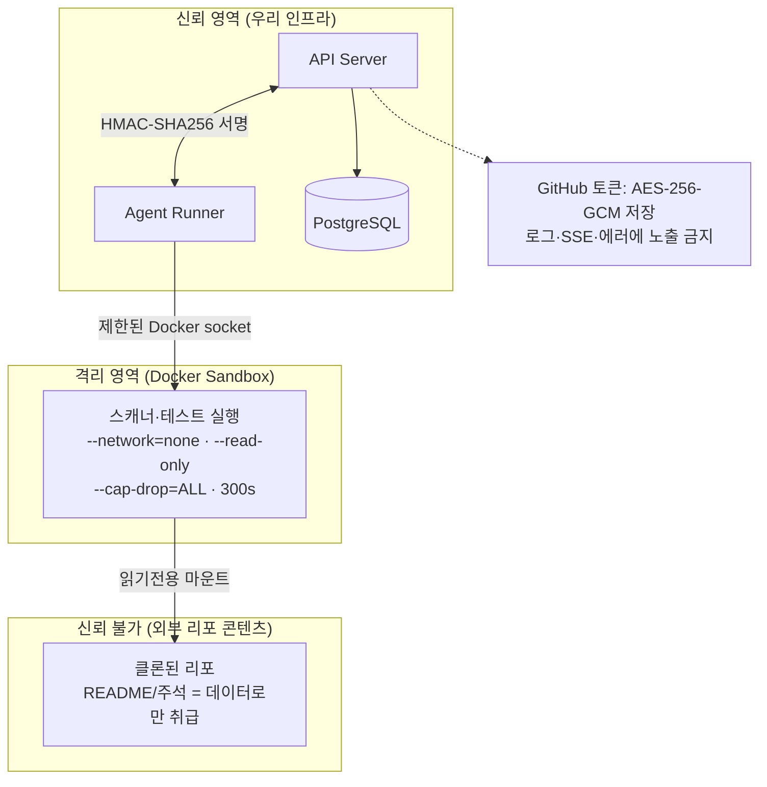
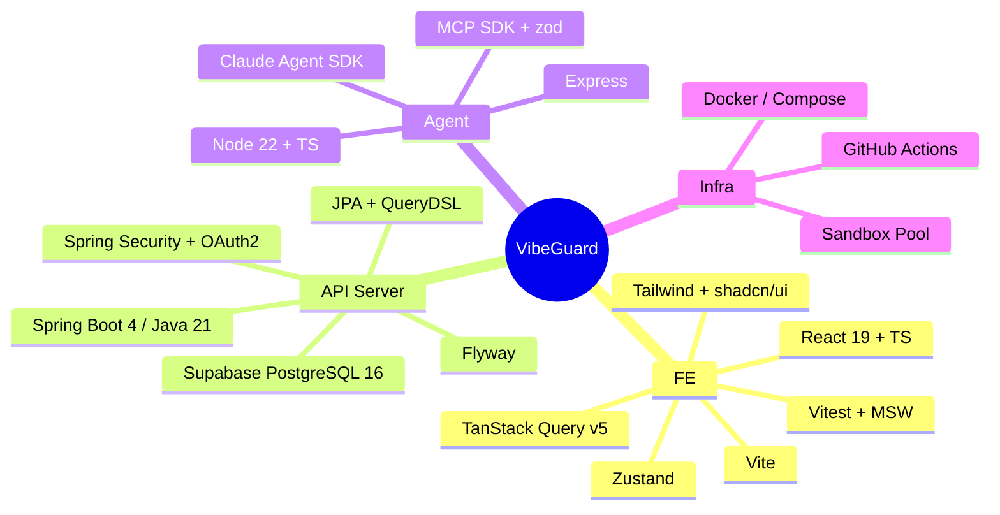
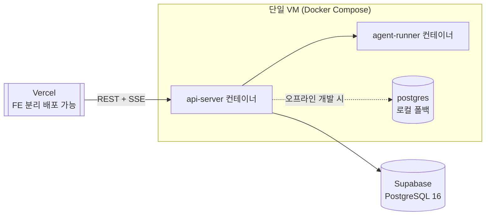

# VibeGuard 아키텍처 문서 (Architecture)

> VibeGuard의 시스템 구조·데이터 흐름·컴포넌트 책임을 시각 자료 중심으로 정리한 문서.
> 다이어그램은 [Mermaid](https://mermaid.js.org/)로 작성되어 GitHub·VS Code(Kiro)에서 그대로 렌더링됩니다.

| 항목 | 내용 |
|---|---|
| 문서 버전 | v1.0 |
| 최종 수정 | 2026-09-09 |
| 관련 문서 | [PRD](./VibeGuard_PRD.md) · [BusinessModel](./VibeGuard_BusinessModel.md) · [TrustModel](./VibeGuard_TrustModel.md) |

---

## 1. 개요

VibeGuard는 GitHub 리포의 보안 취약점을 **탐지 → 검증 → TDD 증명 패치 → PR**까지 자동화하는 멀티 에이전트 시스템이다. 크게 **3티어**로 구성된다.

| 티어 | 런타임 | 역할 |
|---|---|---|
| **Web (FE)** | React 19 + TS + Vite | 대시보드, 실시간 진행 시각화, 증거·Diff 열람 |
| **API Server (BE)** | Spring Boot 4 / Java 21 | REST + SSE, OAuth, 스캔 오케스트레이션(상태머신), DB |
| **Agent (BE)** | Node 22 + TS | Claude Agent SDK 런너 + 자체 MCP 서버 3종 |

설계의 두 핵심 결정:
1. **Agent Runner를 Spring Boot에서 분리** — Claude Agent SDK가 TS/Python만 지원하므로 별도 Node 런너 + HTTP 위임 + HMAC 웹훅 콜백 구조 (PRD §5.2).
2. **Agent 1~4를 서브에이전트가 아닌 독립 세션으로 구동** — 서브에이전트는 MCP 툴에 접근 불가하여 툴이 조용히 사라지므로, 각 단계를 최상위 세션으로 띄우고 필요한 MCP만 주입 (PRD §5.3, R1).

---

## 2. 시스템 컨텍스트 (C4 Level 1)

---

## 3. 컨테이너 구성 (C4 Level 2)

**포트 (개발 기준)**

| 컴포넌트 | 포트 | 비고 |
|---|---|---|
| FE (Vite) | 5173 | `/api` → :8080 프록시 |
| API Server | 8080 | Swagger UI `/swagger-ui.html` |
| Agent Runner | 4000 | `/health`, `/scans` |
| PostgreSQL | 5432 | Supabase 세션 풀러 / 로컬 폴백 |

---

## 4. 멀티 에이전트 파이프라인

### 4.1 스캔 상태머신

### 4.2 에이전트별 책임과 MCP 매핑

| Agent | 입력 | 산출물 | 허용 MCP 툴 (화이트리스트) |
|---|---|---|---|
| 1 Scanner | 클론 경로, 브랜치 | `findings[]` | `scanner__run_trivy/osv/semgrep` |
| 2 Verifier | `findings[]` | `verified[]` (verdict, 권장버전) | `advisory__lookup_cve/query_osv/github_advisory/resolve_fixed_version` |
| 3 Patcher | `verified[]` | `patches[]`, `test_runs[]` | `testrunner__run_tests` |
| 4 PR Author | patches, 증거 | PR URL | `github__*` |

> 단계 간 전달은 구조화된 JSON 아티팩트(`stage_output.json`)로 명시적 전달 — 컨텍스트 오염 방지, 재현성 확보 (PRD §5.3).

### 4.3 Agent 3 — TDD 증명 루프 (Python 메인)

> TDD 검증 계층은 **Python(pytest)** 을 1급 지원 언어로 고정하고 고도화한다. Java/Spring(JUnit)·JS/TS(Vitest/Jest)는 추후 개발 예정 (PRD §6.4).

---

## 5. 핵심 시퀀스 — 스캔부터 PR까지

---

## 6. 데이터 모델 (ERD)

> 스키마 원본은 `BE/api-server/src/main/resources/db/migration/V1__init.sql`. 변경은 Flyway 마이그레이션(`V2__…`)으로만 (PRD §10).

---

## 7. 보안 경계 (Trust Boundary)

| 경계 | 방어 | 근거 |
|---|---|---|
| 사용자 ↔ API | 세션 쿠키(HttpOnly), OAuth2 | §9, SecurityConfig |
| API ↔ Runner | HMAC-SHA256 콜백 서명 | NFR-S4 |
| Runner ↔ Sandbox | 네트워크 차단·읽기전용·권한 드롭 | NFR-S1 |
| Sandbox ↔ 리포 | 리포 콘텐츠는 데이터로만, 프롬프트 인젝션 방어 | NFR-S6 |
| 토큰 저장 | AES-256-GCM, 노출 금지 | NFR-S3 |

> 신뢰도 4축(검증·시스템·투명성·정직성) 상세는 [TrustModel](./VibeGuard_TrustModel.md) 및 PRD §11.4 참고.

---

## 8. 기술 스택 요약

---

## 9. 배포 토폴로지 (데모)

> 데모는 단일 VM + Docker Compose (PRD §12). 운영 DB는 Supabase 관리형, 완전 오프라인 개발 시에만 로컬 Postgres로 폴백.

---

## 10. 문서 맵

| 문서 | 다루는 범위 |
|---|---|
| [PRD](./VibeGuard_PRD.md) | 제품 요구사항 전체 (기능·API·데이터·NFR·신뢰도·마일스톤) |
| [Architecture](./VibeGuard_Architecture.md) | 이 문서 — 시스템 구조·흐름·시각화 |
| [BusinessModel](./VibeGuard_BusinessModel.md) | FREE / PRO 플랜, 과금 가치 |
| [TrustModel](./VibeGuard_TrustModel.md) | 신뢰도 4축 상세, 플랜별 매핑 |
